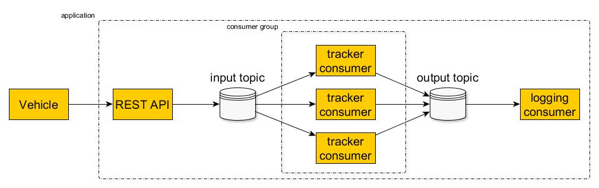

# Configuration

Configure a Kafka cluster using Docker with the following parameters:

- Number of brokers - 3
- Number of partitions - 3
- Replication factor - 2

# Taxi application

Implement a taxi Spring Boot application. The application should consist of:

- REST API which accepts vehicle signals validates that every signal carries a valid vehicle id and 2d coordinates puts the signals into
  the "input" Kafka topic
- The above Kafka cluster 
- Three consumers which poll the signals from the "input" topic, calculate the distance traveled by every unique vehicle so far, store the
  latest distance information per vehicle in another "output" topic 
- A separate consumer that polls the "output" topic and logs the results in realtime

Messages from every vehicle must be processed sequentially!

# Adding Kafka transactions

Wrap the poll (input) > calculate distance > publish (output) loop into Kafka transactions:

